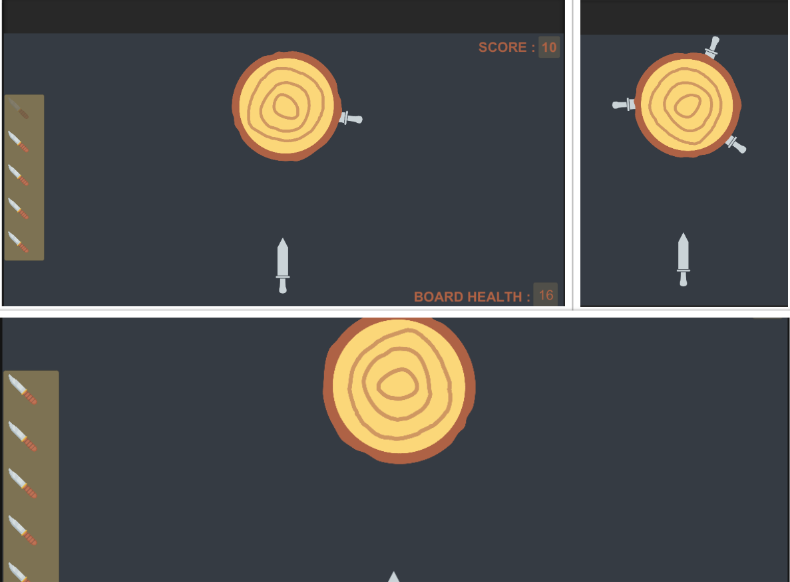

# Knife-Hit-Replica
A remake of a famous game knife hit replicated to the core functionalities

# Link : 
https://drive.google.com/drive/folders/1LvJVWlxzY8R1TE7QV3dK2H_r47T9cspT?usp=sharing

* Link contains the game project.
* Video preview of the game.

# Screenshot : 

* It is a replica of the game knife hit
* The purpose of creating this game is to replicate the game's functionality in Unity(2D).

# System Requirements
* Windows 10 pro
* Unity 2018(LTS)
* Visual Studios 17 or above
* Core i5 processors 7th gen or above.
* Dedicated GPU (Nvidia or AMD) Recomended.

# Getting Started
Start by downloading the project from given link at the top.
Unity 2018 with (LTS) recomended.

* Visual Studio 2019 or 2019 is recommended, It is made to run on Windows OS (8,10).
* Unity 2018(LTS) is recomended.
* Basics of C# language.
* Knowledge on ray tracing with unity.

# Main features to come:
* A complete game with different set of levels.
* Audio and animation visuals.

# Short term goals :
Note: this is subject to change at any time!

* Create more levels on this project.
* Complete rest of the game project.

